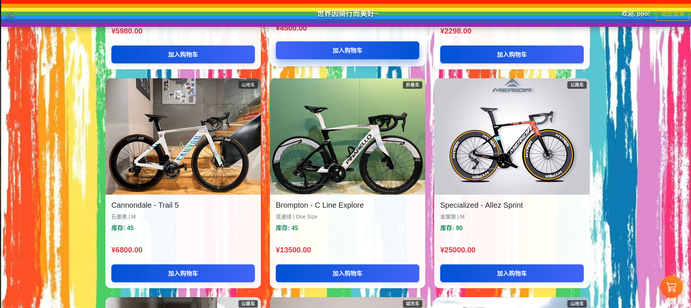

# 两轮承载灵魂——自行车在线商城

这是一个基于微服务架构的自行车在线商城项目。项目实现了前后端分离，后端采用 Spring Cloud 微服务架构，前端使用原生 HTML/CSS/JavaScript 构建。

## ✨ 功能介绍

本系统分为普通用户和管理员两种角色。

### 普通用户
- **登录与注册**: 提供用户登录和注册功能。
- **商品浏览**: 查看所有在售的自行车商品列表。
- **查看大图**: 点击商品图片可以查看更清晰的商品大图。
- **分类筛选**: 登录后，可以按照 "山地车"、"公路车" 等分类筛选商品（未登录用户无法使用此功能）。
- **加入购物车**: 登录后，可以将心仪的商品加入购物车以创建订单（未登录用户无法使用此功能）。

### 管理员
- **独立后台**: 拥有专门的后台管理页面 (`admin.html`)。
- **商品管理**: 对商城的商品进行增、删、改、查等操作。
- **用户管理**: 管理系统中的注册用户信息。
- **订单管理**: 查看和管理用户的订单信息。

## 📸 项目截图



## 🚀 技术栈

### 后端
*   **核心框架:** Spring Boot, Spring Cloud
*   **服务注册与发现:** Nacos
*   **API 网关:** Spring Cloud Gateway
*   **服务间通信:** OpenFeign
*   **容器化:** Docker, Docker Compose

### 前端
*   HTML
*   CSS
*   JavaScript

## 📂 项目结构

项目分为后端和前端，分别位于不同的代码分支中。

### 后端 (`master` 或 `main` 分支)
```
cycleing/
├── docker-compose.yml      # Docker 编排文件
├── gateway-service/        # API 网关服务
├── inventory-service/      # 库存服务
├── order-service/          # 订单服务
├── product-service/        # 商品服务
└── user-service/           # 用户服务
```

### 前端 (`frontend` 分支)
```
frontend/
├── index.html              # 商城主页
├── admin.html              # 管理员后台页面
├── app.js                  # 商城主页逻辑
├── admin.js                # 管理员后台逻辑
├── style.css               # 商城主页样式
├── admin.css               # 管理员后台样式
└── images/                 # 前端图片资源
```

## ⚡ 快速开始

### 1. 环境准备
- Java Development Kit (JDK) 8+
- Maven 3.2+
- Docker & Docker Compose

### 2. 启动后端服务

1.**启动基础设施:**
    在项目根目录下，执行以下命令以构建并启动 Nacos 服务。
  
    docker-compose up -d --build


2.  **验证服务:**
    浏览器访问 `http://localhost:8849`，使用账号 `nacos` 密码 `nacos` 登录。在 "服务列表" 中应能看到所有微服务均已成功注册。

### 3. 启动前端项目
切换到 `frontend` 分支，在 IDE 中右键打开 `index.html` 文件，在右上角选择在你想要的浏览器中打开即可访问商城首页。


