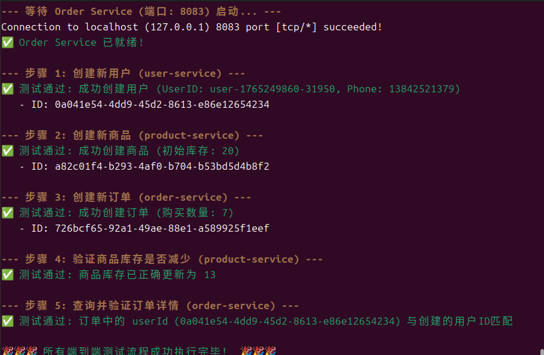

# 项目服务功能及测试说明
## 1. 产品服务（product-service）
- 核心功能：管理自行车产品基础信息（含品牌、分类、型号等）；支持多维度产品查询（按品牌、分类等条件）；提供库存管理能力。

## 2. 用户服务（user-service）
- 核心功能：实现用户信息全生命周期管理（创建、查询、更新、删除）；保障用户ID、手机号、用户名唯一性（内置校验机制）。

## 3. 订单服务（order-service）
- 核心功能：管理订单全量信息；支持多条件订单查询（按购买者、订单状态、时间范围等）；关联记录订单对应的产品及用户信息。
- 测试状态：已完成实现及测试验证。

